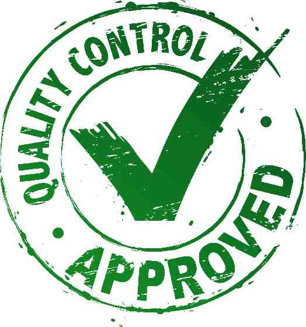

# Princípios S.O.L.I.D.

## Introdução
Olá Softplayers!

Que tal trocarmos uma ideia sobre qualidade de código Orientado a Objetos ?

    

E eu começo com uma pergunta: Você produz código de **qualidade** ?

Tenho certeza que sim, mas que tal nós fazermos uma verificação. 
Nosso código orientado a objetos possui algum dos seguintes sintomas ?
 * Repetição de código
 * Falta de coesão
 * Falta de padrão 
 * Rigidez e fragilidade nas alterações
 * Falta de testabilidade
 * Falta de modularidade
  
Não encontrou esses sintomas no seu código ? Meus parabéns! 
Mas se algum (ou muitos) deles são a realidade de seus projetos, gostaria de compartilhar com vocês os cinco princípios S.O.L.I.D.

## Princípios S.O.L.I.D.

**SOLID** é um acrônimo criado por *Michael Feathers* que representa os 5 princípios da programação orientada a objetos identificados por *Robert Cecil Martin* ou *Uncle Bob* nos princípios de 2000 e que nos ajudam a fugir de muitas armadilhas da OO.
Eles nos dizem o seguinte:

* #### SRP - Single responsibility principle  
Princípio da Responsabilidade Única - Uma classe deve ter um, e somente um, motivo para mudar.

* #### OCP - Open/closed principle  
Princípio do Aberto/Fechado - Você deve ser capaz de estender um comportamento de uma classe sem a necessidade de modificá-lo.

* #### LSP - Liskov substitution principle  
Princípio da substituição de Liskov - As classes derivadas devem ser substituíveis por suas classes bases.

* #### ISP - Interface segregation principle  
Princípio da segregação de interfaces - Muitas interfaces específicas são melhores do que uma interface única geral.

* #### DIP - Dependency inversion principle
Princípio da inversão de dependência - Dependa de abstrações e não de implementações.

Estes cinco princícios se tornaram base para muitos padrões de projetos utilizados até hoje e também fizeram dos softwares produtos mais flexíveis e de fácil evolução. 

## Benefícios da aplicação do S.O.L.I.D.
Lembra dos sintomas negativos que buscamos em nossos softwares antes. Então, agora veremos sintomas positivos que deverão estar presentes em nosso código após a aplicação dos princípios. São eles:

* Melhor design de código, com melhor Organização e Padronização
* Manutenções e Evoluções mais fáceis e seguras
* Melhor Testabilidade
* Melhor Modularização

Legal não é ? 

### Mas antes de iniciarmos, um aviso!
 os princípios SOLID, como o nome diz, são **princípios** e não são regras absolutas. 
 Pos isso, precisamos aplicá-los com cautela a avaliar bem as situações em que eles realmente nos trarão benefícios. 

