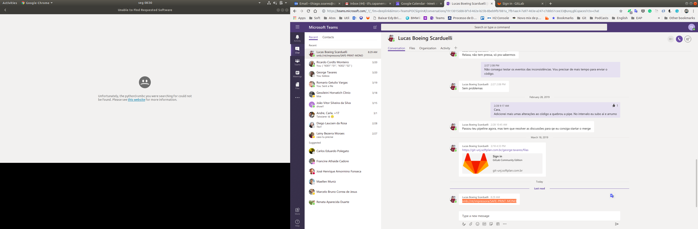

# SRP - Single Responsibility Principle

### Titulo do slide
Notas sobre o slide

* Link  
  [Official Gradle documentation](https://docs.gradle.org)

* Imagem  
  

* Item 1  
  Notas do item 1

* Item 2  
  Notas do item 2

* Item 3  
  Notas do item 3

### Guides
The following guides illustrate how to use some features concretely:

* [Accessing Data with JPA](https://spring.io/guides/gs/accessing-data-jpa/)

### Additional Links
These additional references should also help you:

* [Gradle Build Scans – insights for your project's build](https://scans.gradle.com#gradle)

tete